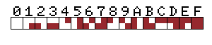

<div align = center>


# RetroBBS - supported encoders
</div>

## Contents

- [Introduction](#Introduction)
- [The PETSCII encoder](#the-petscii-encoder)
- [The MSX encoder](#the-msx-encoder)
- [The VT52 encoder](#the-vt52-encoder)
- The ANSI encoder
- [Appendix](#appendix)

## Introduction

This document explains the different encoders included by default with RetroBBS.
While the different supported control codes and sequences for each encoder are listed here as a reference, the preferred method to use them is through TML tags.

## The PETSCII encoder

**PETSCII** (PET Standard Code of Information Interchange), is the common character encoding used (with some minor differences) in all the _Commodore_ 8bit computers.

_PETSCII_ usually consist of two separate character sets, the original uppercase only, with graphic characters filling the space used by the lowercase characters in standard _ASCII_, and a shifted or lowercase character set, which includes both upper and lowercase characters but switched around, with the lowercase characters taking the place of the uppercase ones and vice versa.

It uses the whole 8bit range, with most of the codes above `$80` allocated to graphic characters in both modes.</br>
A wide range of control codes are provided for controlling the full screen editor present on _Commodore_ 8bit computers, including cursor control, reverse video, texto color and more.


The figure above shows the _Commodore 64 PETSCII_ character set as decoded by _Retroterm_. With the only differences with the actual _PETSCII_ map being the addition of the `BELL` control code, and the reservation of codes $FE and $FF for _Turbo56K_ command codes.

### Plus/4 specific codes


For the _Commodore Plus/4_, the map remains the same, with the addition of 2 control codes for turning on and off the text flashing/blinking feature present on this computer.

### Commodore 128 specific codes


The _Commodore 128 PETSCII map_ contains more differences. While the color codes remain the same, the actual colors selected differ when in 80 column mode, as shown here.</br>
The underline and flash/blink features of the 80 column mode receive their own on/off codes, but the flash codes are different than those used on the _Plus/4_.</br>
The map now includes both `bell` and `tab` control codes, which requires that the codes used to enable and disable case switching be moved from `$08-$09` to `$0B-$0C`

In addition to the _PETSCII_ control codes, the _Commodore 128_ also support a number of _escape_ sequences, but only a few are supported by terminal software and implementation is not reliable.
At this time RetroBBS does not support any of those escape codes.

### Supported clients
1. Turbo56K compatible terminals:
    - Auto detected
    - All supported Turbo56K commands
    - Delete in: `\x14`
    - Delete out: `\x14`
    - Line break in: `\r`
    - Line break out: `\r`
    - BBS modes:
        - Commodore 64: `PET64`
        - Commodore Plus/4: `PET264`
2. CCGMS compatible terminals:
    - Manual selection:
        - CCGMS (25 screen lines)
        - Novaterm/Striketerm (24 lines)
        - HandyTerm (22 lines)
    - Delete in: `\x14`
    - Delete out: `\x14`
    - Line break in: `\r`
    - Line break out: `\r`
    - Support for screen color change using code `$02` followed with any of the normal color codes
    - BBS mode: `PET64CG`
3. Other Commodore 64 color terminals:
    - Manual selection
    - User selectable screen lines
    - Screen color is fixed. Usually black.
    - Delete in: `\x14`
    - Delete out: `\x14`
    - Line break in: `\r`
    - Line break out: `\r`
    - BBS mode: `PET64std`
4. XGraphic compatible terminals (currently only EdgeTerm know to support this):
    - Auto detected after selecting _'Other Commodore 64 color terminals'_
    - 24 screen lines
    - Delete in: `\x14`
    - Delete out: `\x14`
    - Line break in: `\r`
    - Line break out: `\r`
    - Support for:
        - Bi-directional scroll
    - BBS mode: `PET64XG`
5. Plus/4 Microterm:
    - Manual selection
    - User selectable screen lines
    - Delete in: `\x14`
    - Delete out: `\x14`
    - Line break in: `\r`
    - Line break out: `\r`
    - Equivalent to `PET64std` mode but with support for text flashing/blinking
    - BBS mode: `PET264std`
6. VIC-20:
    - Manual selection
    - 22x23 screen size
    - 8 colors
    - Delete in: `\x14`
    - Delete out: `\x14`
    - Line break in: `\r`
    - Line break out: `\r`
    - Otherwise equivalent to `PET64std` mode
    - BBS mode: `PET20std`
7. C-128 80 column color terminal:
    - Manual selection
    - Delete in: `\x14`
    - Delete out: `\x14`
    - Line break in: `\r`
    - Line break out: `\r`
    - User selectable screen lines
    - Supports underline and flash/blink modes
    - BBS mode: `PET128std`

### ScreenCodes

When using the `Line Fill` command or `<LFILL>` _TML_ tag, the `code` parameter refers to a **raw** character code rather than the PETSCII encoding. 
This raw code is the actual position of the character in the computer's internal _character ROM_. In Commodore literature these codes are referred to as **Screencodes**.
The first 128 codes are used for normal video characters, and the second 128 for inverse video characters.


## The MSX encoder

The MSX standard of computers have provision for both keyboard and character set localization.
Therefore, there are several character sets depending on the region where the computer was sold:

- Arabic
- Brazilian (3 variants)
- Danish/Norwegian
- International
- Japanese
- Korean
- Russian

At this moment **RetroBBS** only supports the international character set. This set is a variant of ASCII code page 437, with different graphic characters, and with the `graph` control code (`$01`) used to access the extra graphic characters located in positions used by control codes.<br>
The original MSX encoding include control codes for the screen editor, such as cursor control, TAB, insert, delete, etc. But lacks codes for color and inverse video. Retroterm adds those codes, codes for the function keys, and two new graphic characters.


The diagram above is the map as decoded by _Retroterm_.</br>
The left table is the normal _ASCII_ characters plus control codes and graphic characters. The right table contains the color codes and extra graphic characters, these must be prefixed by the `graph` control code (`$01`).

For example:</br>
To get a heart character the string is:
```
\x01\x43
```
Or to change the character ink/foreground color to green:
```
\x01\x02
```
Because _Retroterm_ implements its screen using a graphic mode, it supports paper or background color for each individual character cell on screen. That's what control codes `$0111` to `$011F` are for.

### Suppported clients

1. Turbo56K compatible terminals:
    - Auto detected
    - All supported Turbo56K commands
    - Delete in: `\x08`
    - Delete out: `\x08`
    - Line break in: `\r`
    - Line break out: `\r`
    - BBS mode: `MSX1`
2. MSX ASCII terminals (Built-in CALL COMTERM, Term4MSX):
    - Manual selection
    - User selected screen size
    - Delete in: `\x08`
    - Delete out: `\x7F`
    - Line break in: `\r`
    - Line break out: `\r`
    - Support for some VT52 style escape sequences enabling:
        - Cursor position
        - Cursor visibility
        - Bi-directional scrolling
    - BBS mode: `MSXstd`

### Character map

Just like with the PETSCII screencodes, the character map represents all the available characters as found in the computer's character ROM.</br>
These codes are the ones used as parameter for the `Line Fill` command or `<LFILL>` TML tag


## The VT52 encoder
This encoder implements the basic _VT52_ escape sequences, and also Compuserve's VidTex, and Atari ST extensions.</br>
The _VT52_ sequences take their name from the **Digital Equipment VT52** terminal, which was the first to include them.
The sequences start with an _escape_ character (`$1B`) followed by one or more characters depending on the command.

### Basic VT52 sequences

The encoding is based on ASCII 7bit, with `$08` as delete/backspace character and `\r\n` for transmitted line break.</br>
The following table only lists the sequences currently used by RetroBBS

`ESC` = `$1B`

| Sequence | Description
|:---:|:---
|`ESC` `A`| Moves cursor up one line
|`ESC` `B`| Moves cursor down one line
|`ESC` `C`| Moves cursor right one space
|`ESC` `D`| Moves cursor left one space
|`ESC` `H`| Moves the cursor to the _Home_ position
|`ESC` `J`| Clears to end of the screen
|`ESC` `Y` `line+32` `column+32`| Position cursor to the given coordinates
|

### Compuserve's VidTex extensions
Compuserve's VidTex is also based on ASCII 7bit, but it adds more sequences to support graphics and file transfers.</br>
In addition to the basic VT52 sequences, RetroBBS uses the following VidTex additions:

`ESC` = `$1B`

| Sequence | Description
|:---|:---
|`ESC` `j`| Clear screen
|`ESC` `G` `4`| Semi-graphics 4 (G4) mode (see below)
|`ESC` `G` `N`| Returns to normal text mode
|`ESC` `G` `M`| Medium Res RLE graphics 128x96px
|`ESC` `G` `H`| High Res RLE graphics 256x128px
|`ESC` `k` `colors`| Changes the text and screen colors (see below)
|`ESC` `I`| Interrogate remote. Upon receiving this sequence, a compatible terminal should respond with a string containing the supported commands.
|

#### Semi-graphics mode
In semi-graphics mode text can be mixed with semigraphic characters.
Any character with the high bit set is interpreted as semigraphic.

```
|7 6 5 4|3 2 1 0|
|1 a b c|d e f g|
```
| abc | Color
|:---:|:---
|000| Green
|001| Yellow
|010| Blue
|011| Red
|100| White
|101| Cyan
|110| Magenta/Purple
|111| Orange

defg: semigraphic quadrants

```
  -----
  |d|e|
  |-+-|
  |f|g|
  -----
```


#### Text and screen colors

The `ESC` `k` `colors` sequence changes both the screen and character color. Actual behavior depends on the terminal software and current screen mode/size.</br>
RetroBBS only supports color when the reported screen width is 40 columns or fewer at this moment, and assumes the background color is selected for the entire screen, while character color can be selected individually.

The `colors` parameter consist of a single byte, containing the character color on its high nibble and the screen color on the lower nibble

The colors are defined as follows:
| value | color
|:---:|:---
|0000| Green
|0001| Yellow
|0010| Blue
|0011| Red
|0100| White
|0101| Cyan
|0110| Magenta/Purple
|0111| Orange
|1000| Black*

* The official _VidTex_ software always replaces black character color with orange instead

### Atari ST character set and VT52 extensions

The Atari ST character set is based on code page 437, but with the exchange of all the box drawing characters with the Hebrew alphabet, and other minor differences.
The backspace character is non-destructive


The following escape sequences are some additions to standard VT52 set.


`ESC` = `$1B`

| Sequence | Description
|:---:|:---
|`ESC` `E`| Clear screen
|`ESC` `b` `color + 32`| Set the foreground color
|`ESC` `c` `color +32`| Set the background color
|`ESC` `e`| Enable (show) cursor
|`ESC` `f`| Disable (hide) cursor
|`ESC` `p`| Reverse on
|`ESC` `q`| Reverse off
|`ESC` `M`| Delete line
|`ESC` `L`| Insert line
|

#### Colors
Foreground and background colors can be selected individually for each character. The number of colors available depends on the screen mode used:
- HiRes: 80x25 max, 2 colors
- MedRes: 80x25 max, 4 colors
     
    0. White
    1. Red
    2. Green
    3. Black
- LoRes: 40x25 max, 16 colors
    
    0. White
    1. Dark Red
    2. Green
    3. Dark Yellow
    4. Dark Blue
    5. Dark Purple
    6. Dark Cyan
    7. Light Grey
    8. Grey
    9. Red
    10. Light Green
    11. Yellow
    12. Blue
    13. Purple
    14. Cyan
    15. Black

### Supported clients

1. VT52 compatible terminals:
    - Manual selection:
    - Manual screen size selection
    - Delete in: `\x08`
    - Delete out: `\x08`
    - Line break in: `\r`
    - Line break out: `\r\n`
    - BBS mode: `VT52`
2. VidTex compatible terminals:
    - Automatic detection after selecting VT52
    - Delete in: `\x08`
    - Delete out: `\x08`
    - Line break in: `\r`
    - Line break out: `\r\n`
    - BBS mode: `VT52`
    - RLE image support
    - Screen color is fixed. Usually black.
    - BBS mode: `VidTex`
3. Atari ST:
    - Manual selection after selecting VT52 mode
    - Delete in: `\x08`
    - Delete out: `\x08 \x08`
    - Line break in: `\r`
    - Line break out: `\r\n`
    - Support for:
        - Bi-directional scroll
        - Cursor enable/disable
    - BBS modes (user selected): 
        - `ATRSTL`
        - `ATRSTM`
        - `ATRSTH`

## Appendix
### a. Xgraphics v3 commands

_Xgraphics_ is a series of commands included in _EdgeTerm_, a terminal for the _Commodore 64_.

These commands use `$80` as the escape character.</br>
Only the commands used by _RetroBBS_ are listed below

`ESC` = `$80`

| Sequence | Description
|:---|:---
|`ESC` `V`| Moves all text up one line while leaving cursor in place.
|`ESC` `W`| Moves all text down one line while leaving cursor in place.
|`ESC` `ESC`| Handshake, if this sequence is received a compatible terminal will respond with the PETSCII uptick character (`$BA`)
|

### b. MSX escape sequences

When the BBS is in `MSXstd` mode, it makes use of some escape sequences supported by the _MSX BIOS_.

`ESC` = `$1B`

| Sequence | Description
|:---|:---
|`ESC` `y5`| Enable (show) cursor
|`ESC` `x5`| Disable (hide) cursor
|`ESC` `M`| Delete line
|`ESC` `L`| Insert line
