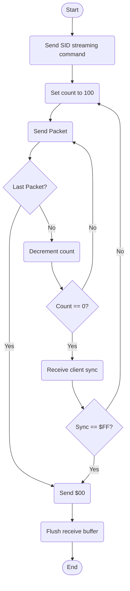
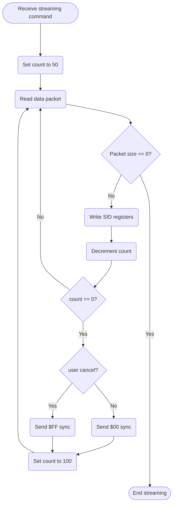

# SID Streaming Protocol:

## Host Side

1. Using *SIDDump* get a dump of SID registers used for each frame.
2. *HVSC* song length files are used to know the playtime. If no song length file is found the default is 3 minutes.
3. The dump is interpreted and a list of values to transmit is generated for each frame. Along with a corresponding bitmap defining which registers are used each frame.

4. Each frame register list is built a data packet taking this form:

|Position | Length (bytes)| Description
|:---:|:---:|---
| 1 | 1 | Length of this data packet (max 30)
| 2 | 4 | Bitmap of SID registers sent. 1bit = 1 register (Big endian)
| 6 onwards | 1 to 24 | Values of each register, in incremental order by default 

5. Send the packets acording to this flowchart:

---
## Client side flowchart:

