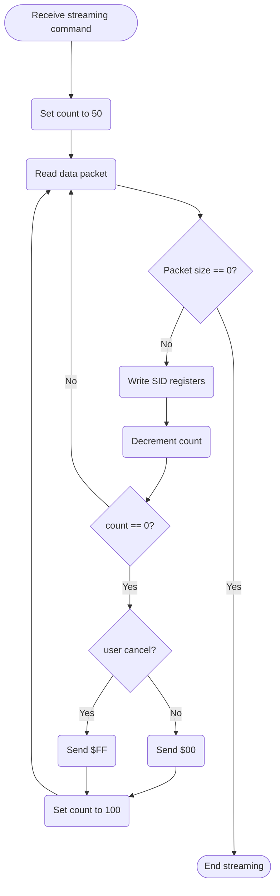

SID Streaming:

Del lado del BBS
-Usando SIDDump para obtener un volcado de registros usados en cada cuadro por el .sid
-Se usa la base de datos de HVSC para saber el tiempo de reproducción de cada .sid, si no se encuentra, el tiempo por defecto es 3 minutos
-Se interpreta el volcado de SIDDump y por cada cuadro se genera una lista valores a escribir, y un bit-map de que registros se van a escribir.
-Se envia cada lista con el siguiente formato:
    1er byte = cantidad de bytes que se envian (30max)

    2do a 5to byte = bit-map de registros a escribir - 1bit = un registro (Big Endian)
    Siguen los valores a escribir en cada registro usado
    Como maximo 30 bytes a transmitir por cuadro
-Se envian 100 paquetes seguidos y luego
-Se espera que la c64 responda que recibio los datos, si la C64 responde con $FF, se detiene el envio de datos enviando un $00
-Repetir hasta completar el volcado, enviando 0 como primer (y unico) caracter del ultimo paquete.

Del lado de la terminal

-Al inicio usar un comando desde la BBS para setear la terminal en el modo adecuado.
-Iniciar la cuenta de paquetes en 50, apagar pantalla
-Leer datos del paquete en una rutina de interrupción propia del modo
-Si la cuenta de paquetes llego a 0 y si el usuario no ha cancelado la reproducción, enviar un byte cualquiera menos $FF, de lo contrario enviar $FF
-Repetir hasta que se reciba un paquete de tamaño $00

